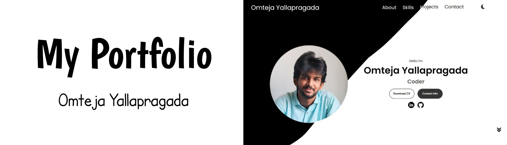

<div align="center">
  <br />
      
    </a>
  <br />

  <div>
    
    
  </div>

  <h3 align="center">My Portfolio</h3>

   <div align="center">
     Omteja Yallapragada
    </div>
</div>

## 📋 <a name="table">Table of Contents</a>

1. 🤖 [Introduction](#introduction)
2. ⚙️ [Tech Stack](#tech-stack)
3. 🔋 [Features](#features)
4. 🤸 [Quick Start](#quick-start)
5. 🕸️ [Snippets](#snippets)
    <!-- 6. 🔗 [Links](#links) -->
    <!-- 7. 🚀 [More](#more) -->

## <a name="introduction">🤖 Introduction</a>

Welcome to My - Portfolio! This project is a simple web portfolio that includes about me, my skills and my contact information.

## <a name="tech-stack">⚙️ Tech Stack</a>

-   HTML 5
-   CSS 3
-   JavaScript
-   Vite

## <a name="features">🔋 Features</a>

👉 **Dark Mode**: Usage of darker interface for enhanced user experience.

👉 **CSS Variables**: Utilize CSS variables to maintain a consistent and easily adjustable styling approach throughout the project

👉 **Flex and Position Properties**: Use of flex and position properties in CSS to create responsive and well-structured layouts.

👉 **Responsive Design**: The application is completely responsive across all devices, employing responsive design techniques such as media queries and fluid layouts.

all these while creating the sushi website with,

-   Navigation Bar
-   Profile Section
-   About Me Section
-   Skills Section
-   Contact Me Section & Footer

## <a name="quick-start">🤸 Quick Start</a>

Follow these steps to set up the project locally on your machine.

**Prerequisites**

Make sure you have the following installed on your machine:

-   [Git](https://git-scm.com/)
-   [Node.js](https://nodejs.org/en)
-   [npm](https://www.npmjs.com/) (Node Package Manager)

**Cloning the Repository**

```bash
git clone https://github.com/omteja04/omteja.github.io.git
```

**Navigate to the project directory:**

```bash
cd omteja.github.io
```

**Installation**

Install the project dependencies using npm:

```bash
npm install

npm install aos
```

**Running the Project**

```bash
npm run dev
```

Open [http://localhost:5173](http://localhost:5173) in your browser to view the project.

## <a name="snippets">🕸️ Snippets</a>

<details>
<summary><code>index.html - nav-bar</code></summary>

```html
<nav id="desktop-nav">
    <div class="logo">Omteja Yallapragada</div>
    <div class="nav-container">
        <ul class="nav-links">
            <li><a href="#about">About</a></li>
            <li><a href="#skills">Skills</a></li>
            <li><a href="#projects">Projects</a></li>
            <li><a href="#contact">Contact</a></li>
        </ul>
        
        
    </div>
</nav>
<nav id="hamburger-nav">
    <div class="logo">Omteja Yallapragada</div>
    <div class="hamburger-menu">
        <div class="nav-container-mobile">
            <div class="hamburger-icon" onclick="toggleMenu()">
                <span></span>
                <span></span>
                <span></span>
            </div>
            
            
        </div>
        <div class="menu-links">
            <li><a href="#about" onclick="toggleMenu()">About</a></li>
            <li><a href="#skills" onclick="toggleMenu()">Skills</a></li>
            <li><a href="#projects" onclick="toggleMenu()">Projects</a></li>
            <li><a href="#contact" onclick="toggleMenu()">Contact</a></li>
        </div>
    </div>
</nav>
```

</details>

<details>
<summary><code>script.js</code></summary>

```javascript
function toggleMenu() {
    const menu = document.querySelector(".menu-links");
    const icon = document.querySelector(".hamburger-icon");
    menu.classList.toggle("open");
    icon.classList.toggle("open");
}

document.body.addEventListener("click", function (event) {
    const menu = document.querySelector(".menu-links");
    const icon = document.querySelector(".hamburger-icon");
    if (!menu.contains(event.target) && !icon.contains(event.target)) {
        menu.classList.remove("open");
        icon.classList.remove("open");
    }
});

document.addEventListener("DOMContentLoaded", () => {
    const moonIcons = document.querySelectorAll("#moon, #moon-mobile");
    const sunIcons = document.querySelectorAll("#sun, #sun-mobile");
    const body = document.body;
    const themeIcons = document.querySelectorAll(".icon");

    function enableDarkTheme() {
        body.classList.add("dark-theme");
        localStorage.setItem("theme", "dark");
        themeIcons.forEach((icon) => {
            icon.src = icon.getAttribute("src-dark");
        });
    }

    function disableDarkTheme() {
        body.classList.remove("dark-theme");
        localStorage.setItem("theme", "light");
        themeIcons.forEach((icon) => {
            icon.src = icon.getAttribute("src-light");
        });
    }

    moonIcons.forEach((moonIcon) => {
        moonIcon.addEventListener("click", enableDarkTheme);
    });

    sunIcons.forEach((sunIcon) => {
        sunIcon.addEventListener("click", disableDarkTheme);
    });

    // Check the saved theme from local storage
    if (localStorage.getItem("theme") === "dark") {
        enableDarkTheme();
    } else {
        disableDarkTheme();
    }
});
```

</details>

<!-- ## <a name="links">🔗 Links</a>

Assets used in the project are [here](https://1drv.ms/u/s!Aik16QFpt84fjS6JjTtlIVyFwRZ_?e=sywxKO) -->

<!-- ## <a name="more">🚀 More</a> -->
